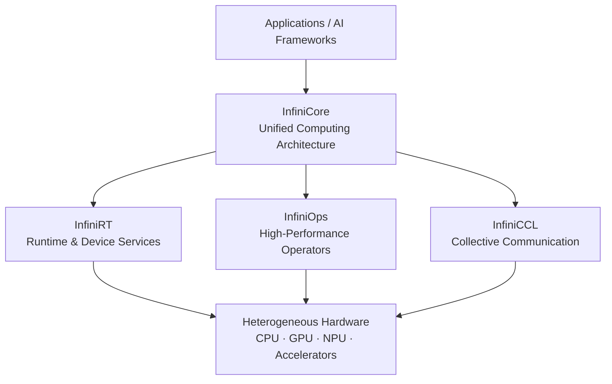

# InfiniCore

**InfiniCore is a unified computing architecture for heterogeneous hardware.**

It provides a common software foundation for building AI and high-performance computing workloads across CPUs, GPUs, NPUs, and other accelerators.

InfiniCore brings together three core components:

* **[InfiniRT](https://github.com/InfiniTensor/InfiniRT)** — runtime and device services.
* **[InfiniOps](https://github.com/InfiniTensor/InfiniOps)** — high-performance computational operators.
* **[InfiniCCL](https://github.com/InfiniTensor/InfiniCCL)** — collective communication for distributed workloads.

Together, they provide a unified stack spanning **runtime, computation, and communication**, while allowing each hardware backend to use its native SDKs, libraries, and optimized implementations.

## Architecture



InfiniCore separates the common programming interface from platform-specific implementations. Applications can target the InfiniCore stack while individual components map operations to the appropriate hardware runtime, optimized kernels, and communication libraries.

## Components

| Component                                                  | Responsibility                 | Highlights                                                                                                  |
| ---------------------------------------------------------- | ------------------------------ | ----------------------------------------------------------------------------------------------------------- |
| **[InfiniRT](https://github.com/InfiniTensor/InfiniRT)**   | Runtime and device abstraction | Device management, memory management, runtime operations, multi-backend runtime interface                   |
| **[InfiniOps](https://github.com/InfiniTensor/InfiniOps)** | Computational operators        | High-performance operators, common operator APIs, backend-specific optimized implementations                |
| **[InfiniCCL](https://github.com/InfiniTensor/InfiniCCL)** | Collective communication       | Unified collective APIs, heterogeneous communication, multiple communication backends, multi-node execution |

### InfiniRT

InfiniRT provides the runtime foundation of InfiniCore.

It exposes common runtime services such as:

* device selection and management;
* device memory allocation and deallocation;
* memory copy and memory initialization;
* runtime dispatch across supported hardware backends;
* common runtime abstractions for higher-level components.

Applications and libraries can use a consistent runtime interface while InfiniRT dispatches operations to the selected hardware backend.

Learn more in the [InfiniRT repository](https://github.com/InfiniTensor/InfiniRT).

### InfiniOps

InfiniOps is the high-performance operator library of InfiniCore.

It provides common operator APIs backed by platform-specific implementations optimized for different processors and accelerators.

InfiniOps is designed around:

* a unified operator interface;
* cross-platform execution;
* optimized native kernels;
* backend-specific vendor libraries and toolchains;
* consistent testing and operator semantics across platforms.

Operator implementations may differ between platforms while preserving the common InfiniOps programming model.

Learn more in the [InfiniOps repository](https://github.com/InfiniTensor/InfiniOps).

### InfiniCCL

InfiniCCL provides collective communication capabilities for distributed AI and HPC workloads.

It offers a unified, NCCL-like communication interface across multiple hardware platforms and communication libraries, with features including:

* collective communication primitives;
* heterogeneous device support;
* multiple communication backends;
* automatic platform detection;
* multi-node execution and orchestration through `icclrun`.

InfiniCCL can work with communication backends including OpenMPI, MPICH, NCCL, and MCCL.

Learn more in the [InfiniCCL repository](https://github.com/InfiniTensor/InfiniCCL).

## Platform Support

InfiniCore is designed for heterogeneous computing environments and supports a growing range of hardware platforms.

The following table summarizes backend availability across the current InfiniCore components.

| Platform              | InfiniRT | InfiniOps | InfiniCCL |
| --------------------- | :------: | :-------: | :-------: |
| **CPU**               |    ✅    |    ✅    |     ◐     |
| **NVIDIA GPU**        |    ✅    |    ✅    |     ✅    |
| **Iluvatar GPU**      |    ✅    |    ✅    |     ✅    |
| **MetaX GPU**         |    ✅    |    ✅    |     ✅    |
| **Hygon DCU**         |    ✅    |    ✅    |     ✅    |
| **Moore Threads GPU** |    ✅    |    ✅    |     ✅    |
| **Cambricon MLU**     |    ✅    |    ✅    |     ✅    |
| **T-Head PPU**        |    ✅    |    ✅    |     —     |
| **Huawei Ascend NPU** |    ✅    |    ✅    |     —     |
| **Mars**              |    ✅    |    ✅    |     —     |

> [!NOTE]
> The table represents backend availability in the current component revisions. Backend availability does **not** imply identical operator, runtime, or collective coverage on every platform.
>
> Hardware support continues to evolve. Refer to the documentation of each component for detailed feature coverage and platform-specific requirements.

Legend:

* ✅ Backend available
* ◐ Partial support
* — Not currently available in the component

### Backend Toolchains

Different platforms use their corresponding native SDKs and toolchains. Examples include:

| Platform      | Typical Toolchain / SDK |
| ------------- | ----------------------- |
| NVIDIA        | CUDA Toolkit            |
| Iluvatar      | CoreX                   |
| MetaX         | MACA                    |
| Hygon         | DTK                     |
| Moore Threads | MUSA                    |
| Cambricon     | Neuware                 |
| Huawei Ascend | CANN                    |

Platform-specific SDK versions and environment requirements are documented in the corresponding component repositories.

## Getting Started

### Clone InfiniCore

Clone the repository together with all InfiniCore components:

```bash
git clone --recurse-submodules https://github.com/InfiniTensor/InfiniCore.git
cd InfiniCore
```

If the repository has already been cloned without submodules:

```bash
git submodule sync --recursive
git submodule update --init --recursive
```

The source tree contains the three core components under `submodules/`:

```text
InfiniCore/
├── submodules/
│   ├── InfiniRT/
│   ├── InfiniOps/
│   └── InfiniCCL/
├── CONTRIBUTING.md
├── LICENSE
└── README.md
```

## Building the Stack

Each InfiniCore component has its own build configuration because different hardware platforms require different SDKs, compilers, libraries, and build options.

For a typical compute stack, start with **InfiniRT**, then build **InfiniOps** against the installed InfiniRT runtime.

### 1. Build InfiniRT

For example, a CPU build can be configured with:

```bash
cmake -S submodules/InfiniRT -B build/InfiniRT \
    -DCMAKE_INSTALL_PREFIX=$HOME/.infini \
    -DWITH_CPU=ON

cmake --build build/InfiniRT -j
cmake --install build/InfiniRT
```

Hardware backends can be selected through the corresponding CMake options, for example:

```text
WITH_CPU
WITH_NVIDIA
WITH_ILUVATAR
WITH_METAX
WITH_HYGON
WITH_THEAD
WITH_MOORE
WITH_CAMBRICON
WITH_ASCEND
```

See the [InfiniRT documentation](https://github.com/InfiniTensor/InfiniRT) for backend-specific configuration.

### 2. Build InfiniOps

After installing InfiniRT, InfiniOps can be built against the same installation prefix.

For example:

```bash
pip install ./submodules/InfiniOps \
    -C cmake.define.INFINI_RT_ROOT=$HOME/.infini \
    -C cmake.define.WITH_CPU=ON
```

Replace `WITH_CPU` with the appropriate backend option when targeting an accelerator.

See the [InfiniOps documentation](https://github.com/InfiniTensor/InfiniOps) for operator coverage, build options, and platform-specific instructions.

### 3. Build InfiniCCL

InfiniCCL can be built independently for distributed communication workloads.

```bash
cd submodules/InfiniCCL
./scripts/build.sh
```

Hardware and communication backends can also be selected explicitly through CMake options.

For example:

```bash
./scripts/build.sh \
    -DWITH_NVIDIA=ON \
    -DWITH_NCCL=ON
```

See the [InfiniCCL documentation](https://github.com/InfiniTensor/InfiniCCL) for multi-node configuration and `icclrun` usage.

## Requirements

The exact dependencies depend on the selected component and hardware backend. Common requirements include:

* a C++17-compatible compiler;
* CMake 3.18 or later;
* Python 3.10 or later for Python tooling and bindings;
* the SDK and compiler toolchain required by the target accelerator;
* backend-specific libraries such as CUDA, CANN, MUSA, Neuware, MPI, or NCCL where applicable.

Refer to each component repository for detailed dependency and environment requirements.

## Repository Integration

InfiniRT, InfiniOps, and InfiniCCL are developed as independent components and integrated into InfiniCore as Git submodules.

This allows each component to evolve independently while InfiniCore provides a consistent combination of component revisions for users who want the complete stack.

To inspect the component revisions in your checkout:

```bash
git submodule status
```

To synchronize and update the components to the revisions selected by the current InfiniCore version:

```bash
git submodule sync --recursive
git submodule update --init --recursive
```

Avoid updating individual submodules to arbitrary revisions when a reproducible InfiniCore environment is required.

## Design Goals

InfiniCore is built around several principles:

* **Unified** — provide common interfaces across heterogeneous hardware platforms.
* **Portable** — allow applications to target different devices without redesigning the entire software stack.
* **High Performance** — retain platform-specific optimization where it matters.
* **Modular** — keep runtime, computation, and communication independently evolvable.
* **Extensible** — make it straightforward to introduce new hardware backends, operators, and communication implementations.
* **Reproducible** — provide compatible component revisions for integration, validation, and release.

## Documentation

Detailed documentation is maintained by each component:

* [InfiniRT](https://github.com/InfiniTensor/InfiniRT) — runtime APIs, backend configuration, build and integration.
* [InfiniOps](https://github.com/InfiniTensor/InfiniOps) — operators, backend support, build, testing, and examples.
* [InfiniCCL](https://github.com/InfiniTensor/InfiniCCL) — collective APIs, communication backends, cluster configuration, and `icclrun`.

## Contributing

Contributions are welcome.

Changes to runtime implementations, operators, communication backends, and hardware support should generally be contributed to the corresponding component repository:

* [InfiniRT](https://github.com/InfiniTensor/InfiniRT)
* [InfiniOps](https://github.com/InfiniTensor/InfiniOps)
* [InfiniCCL](https://github.com/InfiniTensor/InfiniCCL)

Changes related to InfiniCore integration, component revisions, or top-level documentation can be proposed in this repository.

Please read [CONTRIBUTING.md](CONTRIBUTING.md) before submitting a pull request.

## License

InfiniCore is licensed under the [MIT License](LICENSE).
