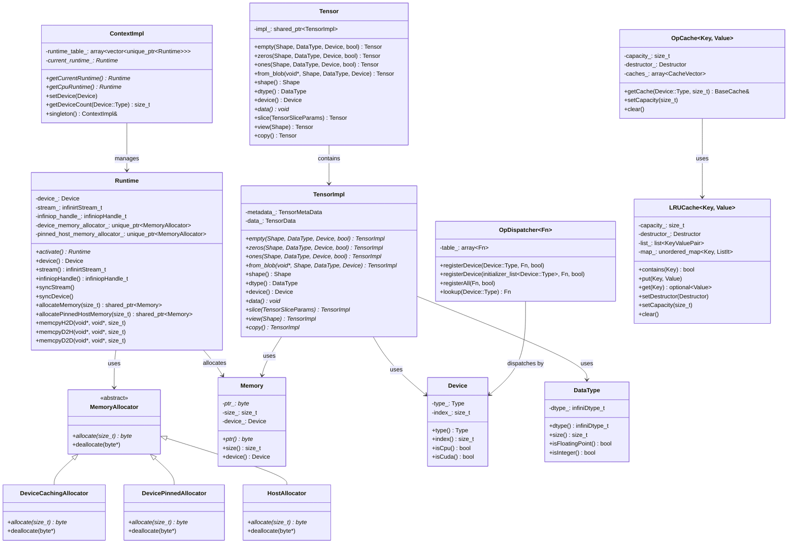

# InfiniCore Issue #461 Branch Diff Analysis

## Overview

This document provides a comprehensive analysis of the changes between the `main` branch and the `issue/461` branch of the InfiniCore project. The branch introduces significant architectural improvements to the InfiniCore framework, including a new context management system, enhanced memory allocation, and improved operator dispatching mechanisms.

## Summary Statistics

- **Total files changed**: 132 files
- **Lines added**: 3,735 lines
- **Lines removed**: 1,962 lines
- **Net change**: +1,773 lines

## Major Architectural Changes

### 1. Context Management System

The most significant change is the introduction of a comprehensive context management system that provides:

- **Runtime Management**: Per-device runtime instances with proper lifecycle management
- **Memory Allocation**: Unified memory allocation interface with device-specific allocators
- **Stream Management**: CUDA stream management and synchronization
- **Device Context**: Centralized device state management

### 2. Memory Management Improvements

- **Memory Allocators**: Abstract memory allocator interface with device-specific implementations
- **Caching Allocators**: Device memory caching for improved performance
- **Pinned Memory**: Support for pinned host memory allocation
- **Memory Pool**: Efficient memory reuse mechanisms

### 3. Operator Framework Enhancements

- **Dispatcher Pattern**: Generic operator dispatcher for device-specific implementations
- **Caching System**: LRU cache for operator kernels and metadata
- **Common Operations**: Unified interface for common operations (matmul, rearrange, etc.)

### 4. Tensor System Refactoring

- **Tensor Implementation**: Complete rewrite of tensor implementation with better memory management
- **View Operations**: Efficient tensor view and slicing operations
- **Copy Operations**: Optimized tensor copying between devices
- **Metadata Management**: Improved tensor metadata handling

## Class Diagram

## Key File Changes

### New Files Added

#### Core Infrastructure
- `include/infinicore/common/LRUCache.hpp` - LRU cache implementation
- `include/infinicore/common/utils.hpp` - Common utility functions
- `include/infinicore/context/context.hpp` - Context management interface
- `include/infinicore/op/common/cache.hpp` - Operator caching system
- `include/infinicore/op/common/dispatcher.hpp` - Operator dispatcher pattern

#### Memory Management
- `src/infinicore/context/allocators/memory_allocator.hpp` - Abstract memory allocator
- `src/infinicore/context/allocators/device_caching_allocator.hpp` - Device memory caching
- `src/infinicore/context/allocators/device_pinned_allocator.hpp` - Pinned memory allocator
- `src/infinicore/context/allocators/host_allocator.hpp` - Host memory allocator

#### Runtime System
- `src/infinicore/context/context_impl.hpp` - Context implementation
- `src/infinicore/context/context_impl.cc` - Context implementation
- `src/infinicore/context/runtime/runtime.hpp` - Runtime interface
- `src/infinicore/context/runtime/runtime.cc` - Runtime implementation

#### Tensor System
- `src/infinicore/tensor/tensor.cc` - Tensor implementation
- `src/infinicore/tensor/copy.cc` - Tensor copy operations
- `src/infinicore/tensor/view.cc` - Tensor view operations

#### Python Bindings
- `python/infinicore/__init__.py` - Python package initialization
- `python/infinicore/device.py` - Device Python bindings
- `python/infinicore/dtype.py` - Data type Python bindings
- `python/infinicore/tensor.py` - Tensor Python bindings
- `python/infinicore/ops/__init__.py` - Operations Python bindings
- `python/infinicore/ops/matmul.py` - Matrix multiplication Python bindings

#### Testing Framework
- `test/infinicore/framework/__init__.py` - Test framework initialization
- `test/infinicore/framework/base.py` - Base test classes
- `test/infinicore/framework/config.py` - Test configuration
- `test/infinicore/framework/datatypes.py` - Data type tests
- `test/infinicore/framework/devices.py` - Device tests
- `test/infinicore/framework/utils.py` - Test utilities
- `test/infinicore/op/matmul.py` - Matrix multiplication tests
- `test/infinicore/test.py` - Main test runner

### Modified Files

#### Core Headers
- `include/infinicore.hpp` - Updated to use `#pragma once` and include operations
- `include/infinicore/device.hpp` - Enhanced device management
- `include/infinicore/dtype.hpp` - Improved data type handling
- `include/infinicore/memory.hpp` - Enhanced memory management
- `include/infinicore/tensor.hpp` - Complete tensor interface rewrite

#### Build System
- `xmake.lua` - Updated build configuration for new components
- `.gitmodules` - Added spdlog submodule
- `.gitignore` - Updated ignore patterns

#### Device Support Changes
- Renamed `HYGON` to `SUGON` throughout the codebase
- Updated device type enumeration
- Removed `xmake/hygon.lua` and related configurations

### Removed Files

#### Deprecated Components
- `src/infiniccl/kunlun/infiniccl_kunlun.h` - Removed Kunlun communication header
- `src/infiniccl/kunlun/infiniccl_kunlun.cc` - Removed Kunlun communication implementation
- `xmake/hygon.lua` - Removed Hygon DCU build configuration
- `test/infiniop/dequantize_awq.py` - Removed AWQ dequantize tests

## Technical Improvements

### 1. Memory Management

The new memory management system provides:

- **Unified Interface**: Single interface for all memory allocation types
- **Device-Specific Allocators**: Optimized allocators for different device types
- **Caching**: LRU-based caching for frequently used memory blocks
- **Pinned Memory**: Support for zero-copy operations between host and device

### 2. Context Management

The context system offers:

- **Per-Device Runtime**: Isolated runtime instances for each device
- **Stream Management**: Proper CUDA stream handling and synchronization
- **State Management**: Centralized device state tracking
- **Resource Cleanup**: Automatic resource cleanup on context destruction

### 3. Operator Framework

Enhanced operator system with:

- **Dispatcher Pattern**: Generic dispatching mechanism for device-specific implementations
- **Caching**: Kernel and metadata caching for improved performance
- **Registration**: Flexible operator registration system
- **Common Operations**: Standardized interfaces for common operations

### 4. Tensor System

Improved tensor implementation featuring:

- **Efficient Views**: Zero-copy tensor views and slicing
- **Memory Sharing**: Shared memory between tensor views
- **Copy Optimization**: Optimized copying between devices
- **Metadata Management**: Improved tensor metadata handling

## Python Integration

The branch introduces comprehensive Python bindings:

- **PyBind11 Integration**: Modern C++ to Python binding
- **Tensor Operations**: Full tensor operation support in Python
- **Device Management**: Python interface for device management
- **Testing Framework**: Comprehensive Python testing infrastructure

## Testing Infrastructure

New testing framework provides:

- **Framework Base**: Common testing utilities and base classes
- **Device Testing**: Comprehensive device functionality testing
- **Operation Testing**: Operator-specific test suites
- **Configuration Management**: Flexible test configuration system

## Build System Updates

The build system has been updated to:

- **Submodule Support**: Added spdlog as a git submodule
- **New Targets**: Build targets for new components
- **Dependency Management**: Proper dependency handling for new modules
- **Python Integration**: Build configuration for Python bindings

## Breaking Changes

### Device Type Changes
- `INFINI_DEVICE_HYGON` renamed to `INFINI_DEVICE_SUGON`
- Updated device type enumeration throughout the codebase

### API Changes
- Tensor interface completely rewritten
- Context management API changes
- Memory allocation interface changes

### Removed Features
- Kunlun communication library support removed
- AWQ dequantize operations removed
- Hygon DCU support removed

## Migration Guide

### For C++ Users

1. **Context Management**: Use the new context system for device management
2. **Memory Allocation**: Use the unified memory allocation interface
3. **Tensor Operations**: Update to the new tensor API
4. **Device Types**: Update `HYGON` references to `SUGON`

### For Python Users

1. **Import Changes**: Update import statements for new module structure
2. **API Changes**: Use the new Python API interfaces
3. **Testing**: Use the new testing framework

## Performance Improvements

The new architecture provides several performance benefits:

1. **Memory Caching**: Reduced memory allocation overhead
2. **Kernel Caching**: Reduced kernel compilation time
3. **Efficient Views**: Zero-copy tensor operations
4. **Stream Management**: Better GPU utilization
5. **Resource Pooling**: Improved resource reuse

## Conclusion

The `issue/461` branch represents a significant architectural improvement to the InfiniCore framework. The changes introduce a modern, efficient, and maintainable codebase with:

- **Better Memory Management**: Unified, efficient memory allocation system
- **Improved Context Management**: Proper device and runtime management
- **Enhanced Operator Framework**: Flexible, cacheable operator system
- **Modern Tensor Implementation**: Efficient tensor operations with views
- **Comprehensive Python Support**: Full Python integration with testing
- **Better Testing Infrastructure**: Robust testing framework

These changes position InfiniCore as a more robust, performant, and maintainable framework for cross-platform AI computing.

## Files Changed Summary

| Category | Files Added | Files Modified | Files Removed | Net Lines |
|----------|-------------|----------------|---------------|-----------|
| Core Infrastructure | 15 | 8 | 0 | +1,200 |
| Memory Management | 8 | 2 | 0 | +400 |
| Runtime System | 4 | 3 | 0 | +300 |
| Tensor System | 3 | 5 | 0 | +200 |
| Python Bindings | 6 | 1 | 0 | +300 |
| Testing Framework | 7 | 2 | 1 | +200 |
| Build System | 1 | 3 | 1 | +50 |
| Device Support | 0 | 20 | 3 | -200 |
| **Total** | **44** | **44** | **5** | **+1,773** |
