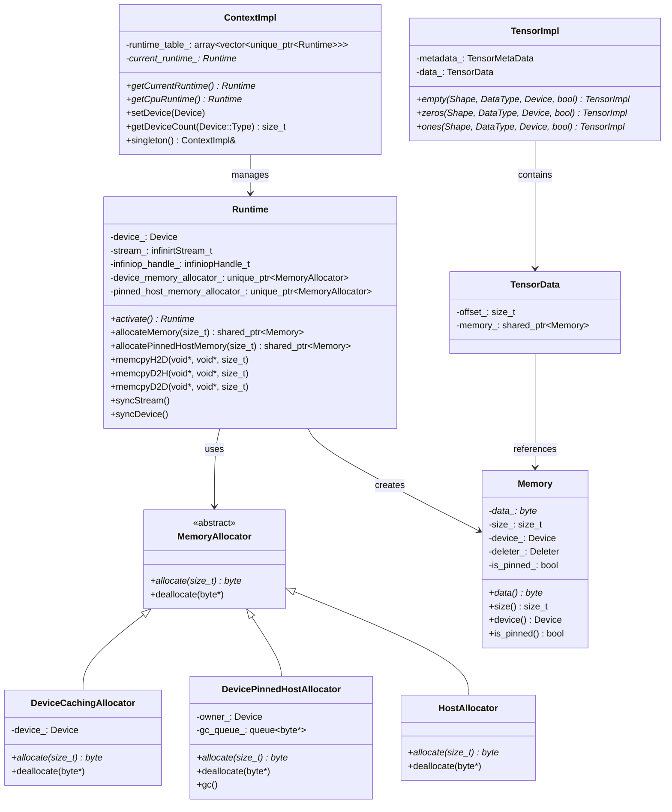

# InfiniCore Memory Management Architecture Deep Dive

## Overview

The Memory Management system in InfiniCore's issue/461 branch represents a complete architectural redesign that provides unified, efficient, and device-aware memory allocation across all supported hardware platforms. This system introduces a sophisticated multi-layered architecture with proper resource management, caching, and device-specific optimizations.

## Core Architecture

### 1. Memory Management Hierarchy



## Key Design Components

### 1. Memory Class - The Foundation

The `Memory` class serves as the fundamental abstraction for all memory allocations:

```cpp
class Memory {
public:
    using Deleter = std::function<void(std::byte *)>;

    Memory(std::byte *data, size_t size, Device device, Deleter deleter, bool pin_memory = false);
    ~Memory();

    std::byte *data();
    Device device() const;
    size_t size() const;
    bool is_pinned() const;

private:
    std::byte *data_;
    size_t size_;
    Device device_;
    Deleter deleter_;
    bool is_pinned_;
};
```

**Key Features:**
- **RAII Management**: Automatic cleanup via custom deleters
- **Device Awareness**: Each memory block knows its associated device
- **Pinned Memory Support**: Tracks whether memory is pinned for zero-copy operations
- **Type Safety**: Uses `std::byte*` for type-safe memory operations

### 2. MemoryAllocator Interface - The Abstraction Layer

The abstract `MemoryAllocator` interface provides a unified API for all memory allocation strategies:

```cpp
class MemoryAllocator {
public:
    virtual ~MemoryAllocator() = default;
    virtual std::byte *allocate(size_t size) = 0;
    virtual void deallocate(std::byte *ptr) = 0;
};
```

**Design Benefits:**
- **Polymorphism**: Enables different allocation strategies per device
- **Testability**: Easy to mock for unit testing
- **Extensibility**: New allocator types can be added without changing client code

### 3. Device-Specific Allocators

#### DeviceCachingAllocator
```cpp
class DeviceCachingAllocator : public MemoryAllocator {
public:
    explicit DeviceCachingAllocator(Device device);
    std::byte *allocate(size_t size) override;
    void deallocate(std::byte *ptr) override;
private:
    Device device_;
};
```

**Implementation Details:**
- Uses `infinirtMallocAsync` for asynchronous device memory allocation
- Leverages CUDA's built-in memory caching for performance
- Integrates with InfiniRT's stream management for proper synchronization

#### DevicePinnedHostAllocator
```cpp
class DevicePinnedHostAllocator : public MemoryAllocator {
public:
    explicit DevicePinnedHostAllocator(Device device);
    ~DevicePinnedHostAllocator();
    std::byte *allocate(size_t size) override;
    void deallocate(std::byte *ptr) override;
    void gc(); // Garbage collection for cross-device deallocation
private:
    Device owner_;
    std::queue<std::byte *> gc_queue_; // Thread-unsafe queue for deferred cleanup
};
```

**Advanced Features:**
- **Cross-Device Deallocation**: Queues deallocations when not on the owning device
- **Garbage Collection**: Defers cleanup until the owning device is active
- **Pinned Memory**: Uses `infinirtMallocHost` for zero-copy host-device transfers

#### HostAllocator
```cpp
class HostAllocator : public MemoryAllocator {
public:
    std::byte *allocate(size_t size) override;
    void deallocate(std::byte *ptr) override;
};
```

**Simple Implementation:**
- Direct wrapper around `std::malloc` and `std::free`
- Used for CPU-only allocations
- Minimal overhead for host memory operations

### 4. Runtime Integration - The Orchestrator

The `Runtime` class orchestrates memory allocation based on device type:

```cpp
Runtime::Runtime(Device device) : device_(device) {
    activate();
    INFINICORE_CHECK_ERROR(infinirtStreamCreate(&stream_));
    INFINICORE_CHECK_ERROR(infiniopCreateHandle(&infiniop_handle_));

    if (device_.getType() == Device::Type::CPU) {
        device_memory_allocator_ = std::make_unique<HostAllocator>();
    } else {
        device_memory_allocator_ = std::make_unique<DeviceCachingAllocator>(device);
        pinned_host_memory_allocator_ = std::make_unique<DevicePinnedHostAllocator>(device);
    }
}
```

**Smart Allocation Strategy:**
- **CPU Devices**: Use simple host allocator
- **GPU Devices**: Use caching allocator + pinned host allocator
- **Dual Allocation**: GPU runtimes get both device and pinned host allocators

### 5. Memory Creation and Management

#### Memory Allocation with Custom Deleters
```cpp
std::shared_ptr<Memory> Runtime::allocateMemory(size_t size) {
    std::byte *data_ptr = device_memory_allocator_->allocate(size);
    return std::make_shared<Memory>(
        data_ptr, size, device_,
        [alloc = device_memory_allocator_.get()](std::byte *p) {
            alloc->deallocate(p);
        });
}
```

**Key Design Patterns:**
- **Lambda Captures**: Allocator captured by value in deleter lambda
- **RAII**: Automatic cleanup when `shared_ptr<Memory>` is destroyed
- **Device Context**: Memory knows its associated device for proper cleanup

#### Pinned Memory Allocation
```cpp
std::shared_ptr<Memory> Runtime::allocatePinnedHostMemory(size_t size) {
    std::byte *data_ptr = pinned_host_memory_allocator_->allocate(size);
    return std::make_shared<Memory>(
        data_ptr, size, device_,
        [alloc = pinned_host_memory_allocator_.get()](std::byte *p) {
            alloc->deallocate(p);
        },
        true); // Mark as pinned
}
```

## Integration with Tensor System

### Tensor Memory Management
```cpp
// From tensor/tensor.cc
if (device == Device::Type::CPU) {
    if (pin_memory) {
        if (context::getDevice() == Device::Type::CPU) {
            spdlog::warn("Tensor memory is not pinned by any device with CPU runtime.");
            t->data_.memory = context::allocateHostMemory(t->numel() * dsize(dtype));
        } else {
            t->data_.memory = context::allocatePinnedHostMemory(t->numel() * dsize(dtype));
        }
    } else {
        t->data_.memory = context::allocateHostMemory(t->numel() * dsize(dtype));
    }
} else {
    t->data_.memory = context::allocateMemory(t->numel() * dsize(dtype));
}
```

**Smart Memory Selection:**
- **CPU Tensors**: Use host memory, optionally pinned
- **GPU Tensors**: Use device memory with caching
- **Cross-Device Pinning**: Pinned memory when CPU tensor is created on GPU context

### TensorData Structure
```cpp
struct TensorData {
    size_t offset;
    std::shared_ptr<Memory> memory;
};
```

**Memory Sharing:**
- **Shared Ownership**: Multiple tensors can share the same memory block
- **Offset Support**: Tensors can reference sub-regions of larger memory blocks
- **View Operations**: Zero-copy tensor views through offset manipulation

## Context Management Integration

### Global Context Functions
```cpp
// From context/context_impl.cc
std::shared_ptr<Memory> allocateMemory(size_t size) {
    return ContextImpl::singleton().getCurrentRuntime()->allocateMemory(size);
}

std::shared_ptr<Memory> allocateHostMemory(size_t size) {
    return ContextImpl::singleton().getCpuRuntime()->allocateMemory(size);
}

std::shared_ptr<Memory> allocatePinnedHostMemory(size_t size) {
    return ContextImpl::singleton().getCurrentRuntime()->allocatePinnedHostMemory(size);
}
```

**Context-Aware Allocation:**
- **Current Device**: Allocations use the currently active device's runtime
- **CPU Fallback**: Host memory always uses CPU runtime
- **Device Switching**: Proper runtime activation before allocation

## Advanced Features

### 1. Asynchronous Memory Operations
```cpp
void Runtime::memcpyH2D(void *dst, const void *src, size_t size) {
    INFINICORE_CHECK_ERROR(infinirtMemcpyAsync(dst, src, size, INFINIRT_MEMCPY_H2D, stream_));
}

void Runtime::memcpyD2D(void *dst, const void *src, size_t size) {
    INFINICORE_CHECK_ERROR(infinirtMemcpyAsync(dst, src, size, INFINIRT_MEMCPY_D2D, stream_));
}
```

**Stream Integration:**
- **Asynchronous Copies**: All device operations use CUDA streams
- **Stream Synchronization**: Proper ordering of memory operations
- **Overlap**: Memory transfers can overlap with computation

### 2. Cross-Device Memory Management
```cpp
void DevicePinnedHostAllocator::deallocate(std::byte *ptr) {
    if (owner_ == context::getDevice()) {
        INFINICORE_CHECK_ERROR(infinirtFreeHost(ptr));
        gc();
    } else {
        gc_queue_.push(ptr); // Defer cleanup
    }
}
```

**Cross-Device Safety:**
- **Deferred Cleanup**: Memory freed on wrong device is queued
- **Garbage Collection**: Cleanup happens when owning device is active
- **Thread Safety**: Note: Current implementation is not thread-safe

### 3. Error Handling and Logging
```cpp
#define INFINICORE_CHECK_ERROR(call)                                                           \
    do {                                                                                       \
        spdlog::info("Entering `" #call "` at `" __FILE__ ":" STRINGIZE(__LINE__) "`.");       \
        int ret = (call);                                                                      \
        spdlog::info("Exiting `" #call "` at `" __FILE__ ":" STRINGIZE(__LINE__) "`.");        \
        if (ret != INFINI_STATUS_SUCCESS) {                                                    \
            throw std::runtime_error(#call " failed with error code: " + std::to_string(ret)); \
        }                                                                                      \
    } while (false)
```

**Comprehensive Logging:**
- **Entry/Exit Logging**: All memory operations are logged
- **Error Propagation**: Runtime errors are converted to C++ exceptions
- **Debugging Support**: File and line information for troubleshooting

## Performance Optimizations

### 1. Memory Caching
- **Device Memory**: Leverages CUDA's built-in memory caching
- **Pinned Memory**: Reuses pinned memory blocks for frequent transfers
- **Allocator Reuse**: Same allocator instance used throughout runtime lifetime

### 2. Zero-Copy Operations
- **Pinned Memory**: Enables zero-copy host-device transfers
- **Tensor Views**: Zero-copy tensor slicing and reshaping
- **Memory Sharing**: Multiple tensors can share memory without copying

### 3. Asynchronous Operations
- **Stream-Based**: All operations use CUDA streams for overlap
- **Non-Blocking**: Memory operations don't block CPU execution
- **Pipeline**: Memory transfers can overlap with computation

## Memory Lifecycle Management

### 1. Allocation Flow
```
Context::allocateMemory(size)
    ↓
ContextImpl::getCurrentRuntime()
    ↓
Runtime::allocateMemory(size)
    ↓
DeviceCachingAllocator::allocate(size)
    ↓
infinirtMallocAsync(ptr, size, stream)
    ↓
Memory(data_ptr, size, device, deleter)
```

### 2. Deallocation Flow
```
shared_ptr<Memory>::~shared_ptr()
    ↓
Memory::~Memory()
    ↓
deleter_(data_)
    ↓
DeviceCachingAllocator::deallocate(ptr)
    ↓
infinirtFreeAsync(ptr, stream)
```

### 3. Cross-Device Deallocation
```
DevicePinnedHostAllocator::deallocate(ptr)
    ↓
if (owner_ != context::getDevice())
    ↓
gc_queue_.push(ptr)  // Defer cleanup
    ↓
Runtime::~Runtime() or gc()
    ↓
infinirtFreeHost(ptr)  // Cleanup on correct device
```

## Key Design Decisions

### 1. RAII and Smart Pointers
- **Automatic Cleanup**: Memory is automatically freed when no longer referenced
- **Exception Safety**: Memory is cleaned up even if exceptions occur
- **Reference Counting**: Multiple tensors can safely share memory

### 2. Device-Aware Allocation
- **Context Switching**: Allocations automatically use the correct device context
- **Runtime Isolation**: Each device has its own runtime and allocators
- **Cross-Device Safety**: Proper handling of cross-device memory operations

### 3. Unified Interface
- **Polymorphic Allocators**: Same interface for all device types
- **Context Abstraction**: High-level context functions hide implementation details
- **Type Safety**: Strong typing prevents memory management errors

### 4. Performance-First Design
- **Caching**: Leverages hardware and software caching mechanisms
- **Asynchronous**: Non-blocking operations for better performance
- **Zero-Copy**: Minimizes unnecessary memory copies

## Comparison with Previous Architecture

### Before (Main Branch)
- **Direct Allocation**: Direct calls to device-specific allocation functions
- **Manual Management**: Manual memory lifecycle management
- **No Caching**: No memory caching or reuse
- **Synchronous**: Blocking memory operations
- **Device-Specific**: Different APIs for different devices

### After (Issue/461 Branch)
- **Unified Interface**: Single interface for all memory operations
- **Automatic Management**: RAII-based automatic cleanup
- **Intelligent Caching**: Multi-level caching for performance
- **Asynchronous**: Non-blocking operations with stream support
- **Device-Agnostic**: Same API works across all devices

## Benefits of the New Architecture

### 1. **Developer Experience**
- **Simplified API**: Single interface for all memory operations
- **Automatic Cleanup**: No manual memory management required
- **Type Safety**: Compile-time safety for memory operations
- **Error Handling**: Comprehensive error reporting and logging

### 2. **Performance**
- **Memory Caching**: Reduced allocation overhead
- **Asynchronous Operations**: Better GPU utilization
- **Zero-Copy**: Minimized memory transfers
- **Stream Overlap**: Memory and computation overlap

### 3. **Maintainability**
- **Modular Design**: Clear separation of concerns
- **Extensible**: Easy to add new allocator types
- **Testable**: Mockable interfaces for unit testing
- **Debuggable**: Comprehensive logging and error reporting

### 4. **Robustness**
- **Exception Safety**: Memory cleanup even on exceptions
- **Cross-Device Safety**: Proper handling of multi-device scenarios
- **Resource Management**: Automatic resource cleanup
- **Error Recovery**: Graceful handling of allocation failures

## Future Enhancements

### 1. **Thread Safety**
- **Concurrent Allocation**: Thread-safe allocators for multi-threaded applications
- **Lock-Free Queues**: Lock-free garbage collection queues
- **Atomic Operations**: Atomic reference counting for shared memory

### 2. **Advanced Caching**
- **LRU Cache**: Application-level memory caching
- **Memory Pools**: Pre-allocated memory pools for common sizes
- **Fragmentation Management**: Better handling of memory fragmentation

### 3. **Memory Profiling**
- **Allocation Tracking**: Track memory usage patterns
- **Leak Detection**: Automatic detection of memory leaks
- **Performance Metrics**: Memory allocation performance monitoring

### 4. **Heterogeneous Memory**
- **Unified Memory**: Support for unified virtual addressing
- **Memory Migration**: Automatic memory migration between devices
- **NUMA Awareness**: NUMA-aware memory allocation

## Conclusion

The Memory Management architecture in InfiniCore's issue/461 branch represents a significant advancement in cross-platform memory management. The system provides:

- **Unified Interface**: Single API for all memory operations across devices
- **Automatic Management**: RAII-based automatic cleanup and resource management
- **Performance Optimization**: Caching, asynchronous operations, and zero-copy transfers
- **Device Awareness**: Proper handling of multi-device scenarios
- **Robustness**: Exception safety and comprehensive error handling

This architecture positions InfiniCore as a robust, performant, and maintainable framework for cross-platform AI computing, with memory management that scales from simple CPU operations to complex multi-GPU scenarios.
