完成了算子赛题 T1-1-1 ：
- Exp
- Sin
- Cos
- LeakyRelu
- Tanh
- Sigmoid Backward
- HardSwish
- Cast
- Where

在内的所有9个算子的实现，以及 T1-1-2的：

……

并通过了CPU、Metax平台中Pytorch单元测试代码的验证。

# PyTorch单元测试
## 1. Exp算子测试

- 测试能够覆盖多种输入输出的形状以及排布且已通过CPU、Metax平台上的PyTorch测试
- 支持数据类型涵盖了f32, f16, bf16

### CPU平台测试结果
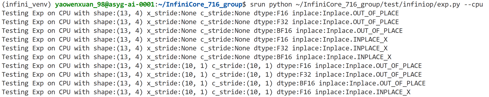
……
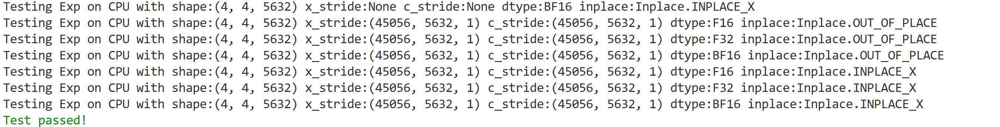

### Metax平台测试结果
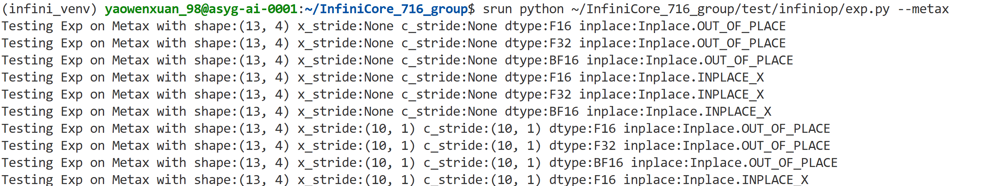
……
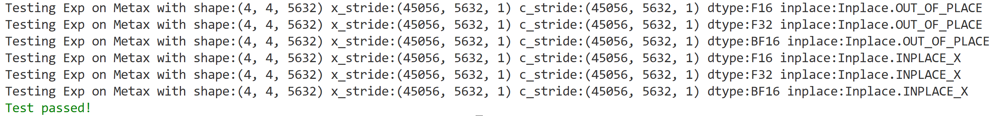

## 2. Sin算子测试
- 测试能够覆盖多种输入输出的形状以及排布且已通过CPU、Metax平台上的PyTorch测试
- 支持数据类型涵盖了f32, f16, bf16

### CPU平台测试结果

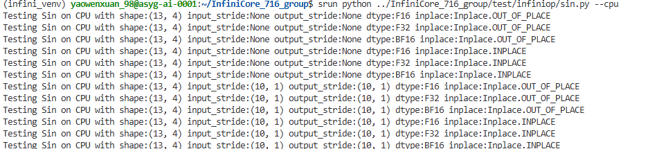

……

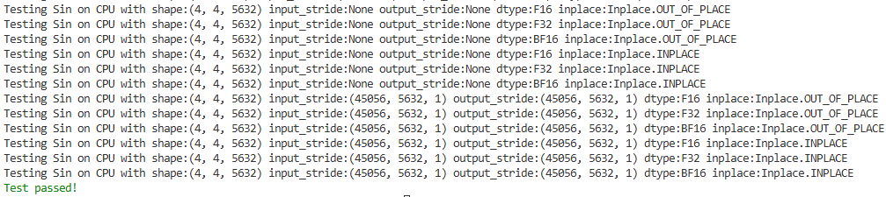

### Metax平台测试结果

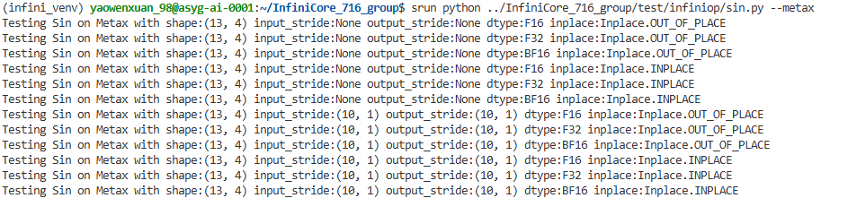

……

## 3. Cos算子测试

- 测试能够覆盖多种输入输出的形状以及排布且已通过CPU、Metax平台上的PyTorch测试
- 支持数据类型涵盖了f32, f16, bf16
### CPU平台测试结果
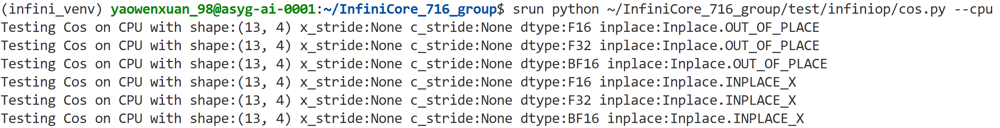
……
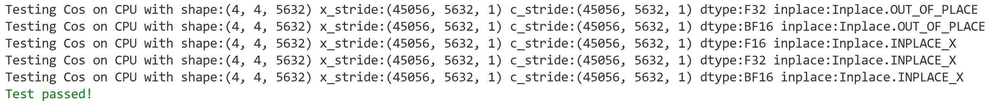

### Metax平台测试结果
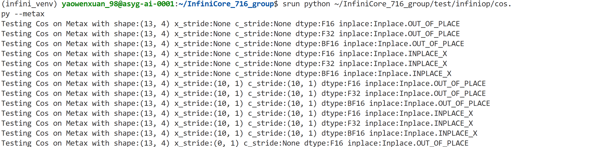
……
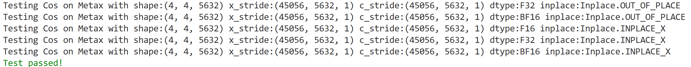

## 4. LeakyRelu算子测试
- 测试能够覆盖多种输入输出的形状以及排布且已通过CPU、Metax平台上的PyTorch测试
- 支持数据类型涵盖了f32, f16, bf16
### CPU平台测试结果
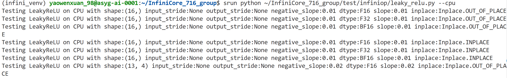
……
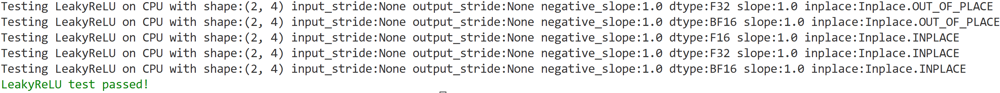
### Metax平台测试结果
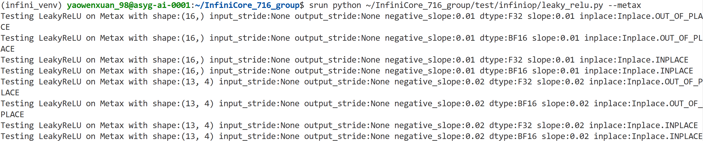
……

## 5. Tanh算子测试
- 测试能够覆盖多种输入输出的形状以及排布且已通过CPU、Metax平台上的PyTorch测试
- 支持数据类型涵盖了f32, f16, bf16

### CPU平台测试结果

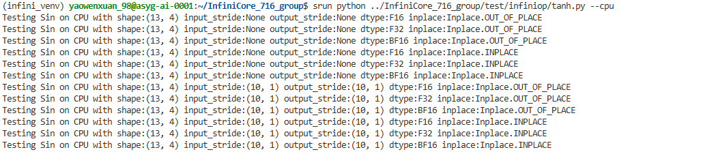

……

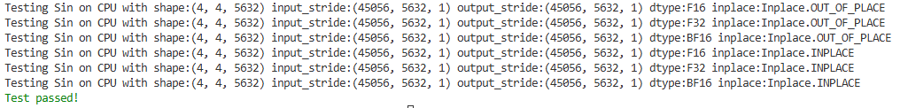

### Metax平台测试结果

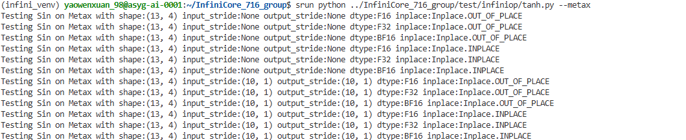

……

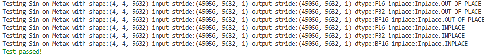

## 6. Sigmoid Backward算子测试
- 测试能够覆盖多种输入输出的形状以及排布且已通过CPU、Metax平台上的PyTorch测试
- 支持数据类型涵盖了f32, f16, bf16
### CPU平台测试结果
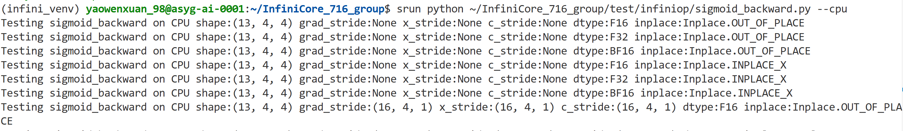
……
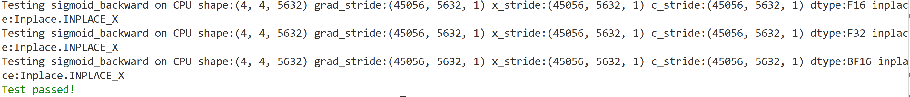

### Metax平台测试结果
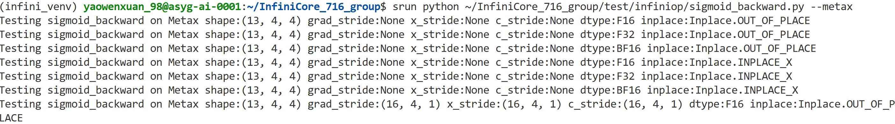
……
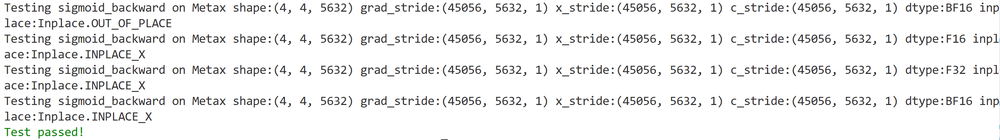

## 7. HardSwish算子测试
- 测试能够覆盖多种输入输出的形状以及排布且已通过CPU、Metax平台上的PyTorch测试
- 支持数据类型涵盖了f32, f16, bf16
### CPU平台测试结果
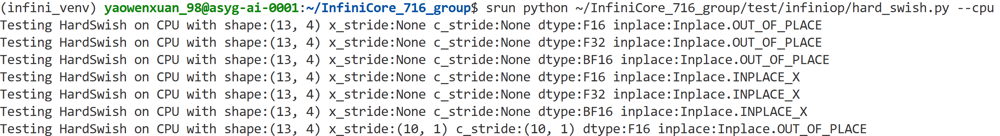
……
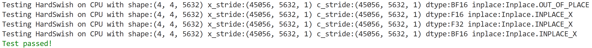
### Metax平台测试结果
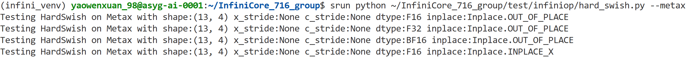
……
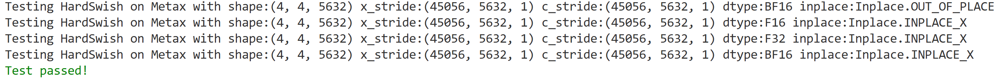

## 8. Cast算子测试
- 测试能够覆盖多种输入输出的形状以及排布且已通过CPU、Metax平台上的PyTorch测试
- 支持整数类型 (int32, int64, uint32, uint64) 之间互转
- 支持浮点类型 (f32, f16, f64) 之间互转
- 支持整数类型 (int32, int64, uint32, uint64) 到浮点类型 (f32, f16, f64) 的互转
### CPU平台测试结果
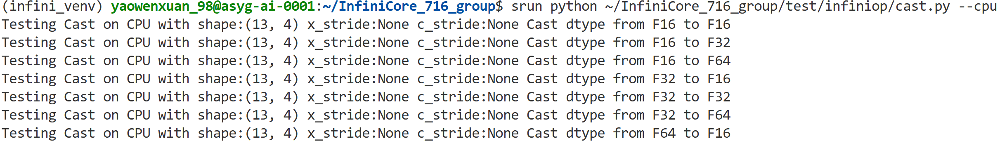
……
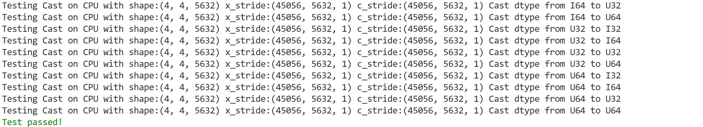
### Metax平台测试结果
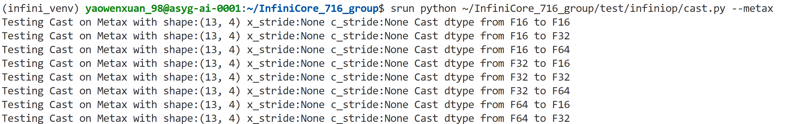
……
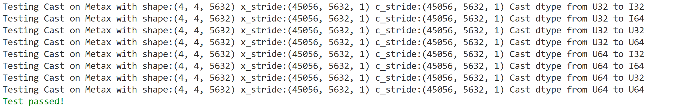

## 9. Where算子测试

- 测试能够覆盖多种输入输出的形状以及排布且已通过CPU、Metax平台上的PyTorch测试
- 支持数据类型涵盖了f32, f16,f64, bf16,bool,I8,I16,I32,I64

### CPU平台测试结果

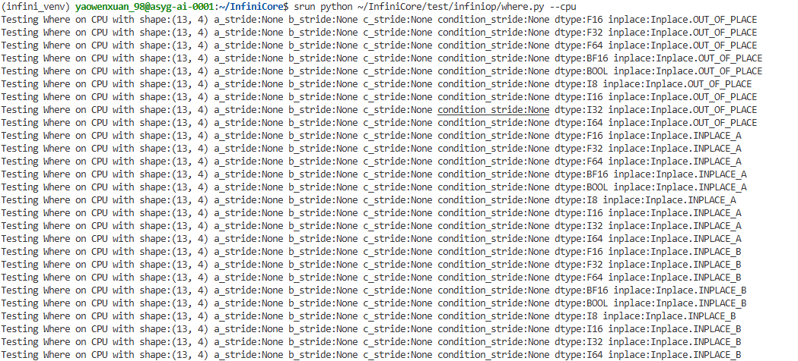

……

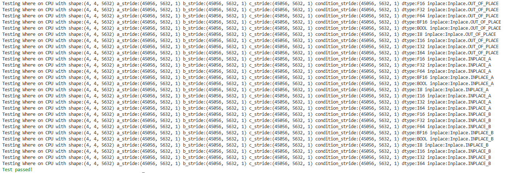

### Metax平台测试结果

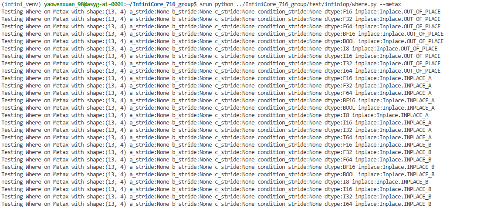

……

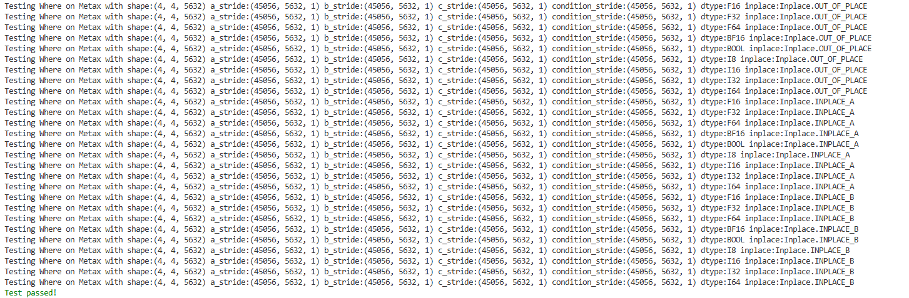

